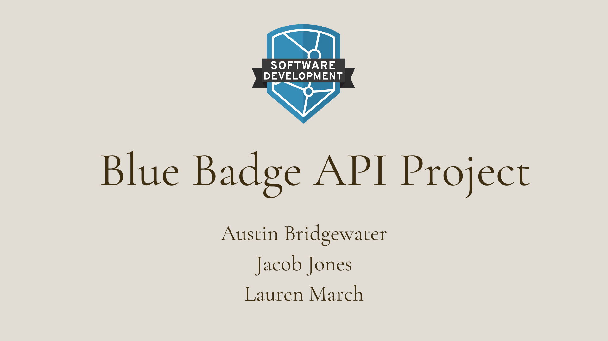

# :small_blue_diamond: Blue Badge Group API Project 

The Blue Badge API Project is a group project designed by Eleven Fifty Academy to evaluate students' progress in the Software Development program. The assignment was to build a .NET Framework API Web Application using n-tier architecture covering a topic of our group's choosing. The API needed to include at least one custom table per group member, with at least one of the tables implementing Foreign Key relationships.

My group created an application called "Peace of Mind". "Peace of Mind" is a tool that allows a user to access a database of mental health experts and therapists. They can correspond with a therapist to schedule time to meet in-person or virtually. Users can also search through the application to locate local experts in the field. The target audience is for adults who are looking for professional assistance with their mental health.
 
We chose this project because there is an increasing awareness about the subject mental health in our day to day lives. Individuals are prioritizing their mental health more than ever before and this app would be a tool to help individuals access mental health professionals in a convenient and private way.

## :computer: Step One: Building the Database
We started the project by each creating a table for the database:
* Therapist Table: Lauren
* Therapist Rating Table: Jacob
* Therapist Office Location Table: Austin

Each therapist in the database has the following attributes:
* ID Number
* First and Last Name
* Gender
* Licensure/Degree Information
* Areas of Specialty
* Physical Office Location(s)
* Average "Star" Rating from Users

